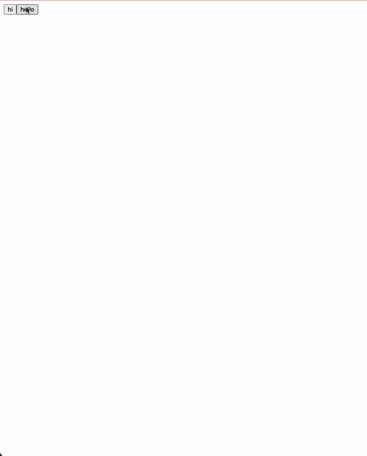

# 
[](https://www.npmjs.com/package/react-achievement-system)

<p align="center">
    
</p>
# react-achievement-system
You don't care about the achievement system. 
React-achievement-system will manage both achievement-related status and feedback when achieved.

## Environments in which to use dot-map

- Browser - chrome


## Installation
```shell
npm i --save react-achievement-system recoil
```

## Getting started

Methods for using this library are divided into three stages.

### 1. create achievement atom 
```typescript
export const achievementStore = atom({
    key: 'achievement-store',
    default: {
        "hi" : false,
        "hello" : false
    }
});
```
### 2. AchievementSystemRoot
```typescript
import React from 'react';
import ReactDOM from 'react-dom';
import App from './App';
import {AchievementSystemRoot} from "react-achievement-system";
import { achievementStore } from './achieve';

ReactDOM.render(
    <React.StrictMode>
        <AchievementSystemRoot store={achievementStore}>
            <App />
        </AchievementSystemRoot>
    </React.StrictMode>,
document.getElementById('root')
);
```
### 3. useAchieve
```typescript
import React from 'react';
import {achievementStore} from "./achieve";
import { useAchieve } from 'react-achievement-system';


function App() {

  const {achieve} = useAchieve(achievementStore);

  return (
    <div className="App">
      <button onClick={() => achieve('hi')}>hi</button>
      <button onClick={() => achieve('hello')}>hello</button>
    </div>
  );
}

export default App;
```


